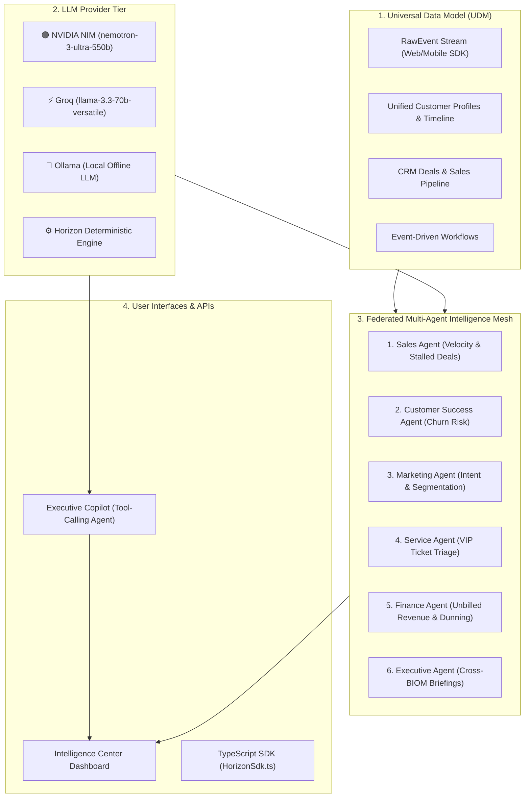

# Horizon 360: Universal Business Operating System & AI Multi-Agent Platform

Horizon 360 is an enterprise-grade Customer Data Platform (CDP), Universal CRM, and **Autonomous Multi-Agent Intelligence Mesh** featuring a Python/Django backend, React frontend, and native integration with high-speed LLM providers (**NVIDIA NIM**, **Groq**, **Ollama**).

---

## Architecture Overview



---

## 1. Prerequisites

Choose **either** Docker (recommended) or Local Python/Node environment:

- **Option A (Docker - Recommended)**: Docker Desktop with Docker Compose.
- **Option B (Local Dev)**: Python 3.11+, Node.js 18+, Redis, and `uv` (or pip).

---

## 2. Configuration (`.env`)

A pre-configured [`.env`](file:///D:/horizon360-AI-Integration/horizon360/.env) is located in `horizon360/.env`. You can choose your preferred active LLM provider:

```ini
# ==========================================
# Horizon 360 AI & LLM Provider Configuration
# ==========================================

# Active Provider: 'nvidia', 'groq', 'ollama', 'openai', or 'auto'
LLM_PROVIDER=nvidia

# NVIDIA NIM Configuration (Active & Verified)
NVIDIA_API_KEY="nvapi-your-nvidia-api-key-here"
LLM_MODEL="nvidia/nemotron-3-ultra-550b-a55b"

# Groq Configuration (Optional / Secondary)
GROQ_API_KEY="gsk_..."
```

> **Note**: If no API key is set, the system automatically uses the zero-dependency **Horizon Deterministic Fallback Engine** (`horizon-deterministic-v1`).

---

## 3. Quick Start with Docker (Recommended)

Run the complete multi-service stack (Postgres, Redis, Django Web, Celery Worker, React Frontend) in one command:

```bash
# 1. Navigate to the horizon360 directory
cd horizon360

# 2. Build and start all containers
docker compose up --build
```

### Access URLs:
| Service | URL | Description |
| :--- | :--- | :--- |
| **Web Frontend** | `http://localhost:1420` | React Dashboard, Customer 360, Pipeline & Copilot |
| **Django Backend API** | `http://localhost:8000` | REST API endpoints |
| **Superadmin Portal** | `http://localhost:8000/admin` | Django God-Mode Admin |

---

## 4. Local Development Setup (Without Docker)

### Backend (Django + Celery)

```bash
# 1. Navigate to the horizon360 directory
cd horizon360

# 2. Run Database Migrations
uv run --with-requirements requirements.txt python manage.py migrate

# 3. Setup Default Admin & Seed Demo Data
uv run --with-requirements requirements.txt python setup_demo.py
uv run --with-requirements requirements.txt python manage.py seed_demo

# 4. Start the Django Server
uv run --with-requirements requirements.txt python manage.py runserver 0.0.0.0:8000
```

*(Optional) Start Celery worker in a separate terminal:*
```bash
uv run --with-requirements requirements.txt celery -A horizon360 worker -l info
```

### Frontend (React + Tailwind CSS + Vite)

```bash
# 1. Navigate to frontend directory
cd horizon360/frontend

# 2. Install dependencies & start Vite dev server
npm install
npm run dev
```
Access the local frontend at `http://localhost:5173` or `http://localhost:1420`.

---

## 5. Demo Credentials

| Role | Username | Password | Purpose |
| :--- | :--- | :--- | :--- |
| **Company Admin** | `admin` | `admin` | Access the CRM, Customer 360, Copilot, and Intelligence Center |
| **Superuser** | `root` | `root` | Full platform database administration (`/admin`) |

---

## 6. How to Use the AI & Agent Features

### A. Executive Copilot
1. Log into the web dashboard at `http://localhost:1420` (or `http://localhost:5173`).
2. Type queries into the **Horizon Copilot** input or click quick-prompt pills:
   - *"What deals are at risk?"*
   - *"What's our current pipeline?"*
   - *"Tell me about alice@example.com"*
   - *"Why is Enterprise License at risk?"*
   - *"What should sales focus on?"*
3. Copilot returns grounded analyses, source links (`View Deal`, `Customer 360`), and one-click action cards.

### B. Triggering the Multi-Agent Intelligence Mesh
- **Via Frontend UI**: Click the **"⚡ Run All 6 Agents"** button in the header or Intelligence Center.
- **Via CLI Command**:
  ```bash
  cd horizon360
  uv run --with-requirements requirements.txt python manage.py run_intelligence_mesh
  ```
- **Via REST API**:
  ```http
  POST /api/intelligence/run/
  Authorization: Bearer <JWT_TOKEN>
  ```

### C. Executing Autonomous Actions
Click **"⚡ Apply AI Playbook"** or **"Draft Email"** on any insight card in the dashboard to execute automated tagging or SDR outreach drafts.

---

## 7. Using the TypeScript Ingestion SDK

Test event transmission and unified customer identity resolution using the TypeScript SDK:

```bash
npx ts-node HorizonSdk.ts
```

This script:
1. Authenticates against the backend API.
2. Registers an event schema (`cart.viewed`).
3. Transmits an event payload.
4. Retrieves the updated real-time Customer 360 profile.

---

## 8. Running the Automated Test Suite

To run all **54 unit tests** covering CDP Core, CRM, Copilot, Multi-Agent Mesh, and AI Workflow actions:

```bash
cd horizon360
uv run --with-requirements requirements.txt python manage.py test cdp_core crm copilot intelligence
```

Expected output:
```text
Ran 54 tests in ~35s
OK
```
